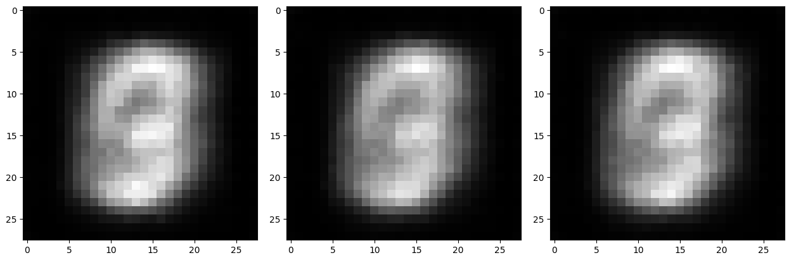

# Mnist-GANs
 The primary objective of the project is to generate MNIST dataset instances using GANs (Generative Adversarial Networks). Initially, as it wasn't clear that I would be using MNIST for this purpose, the dataset was passed through an Autoencoder model. Subsequently, the Discriminator and Generator were trained. The Spectral Normalization method was employed to mitigate Mode Collapse.

Upon examining the generated instances, it is evident that they do not precisely resemble numbers. I would appreciate it if you could provide me with your suggestions regarding this matter.

The most recent outputs I have received are as follows: 

